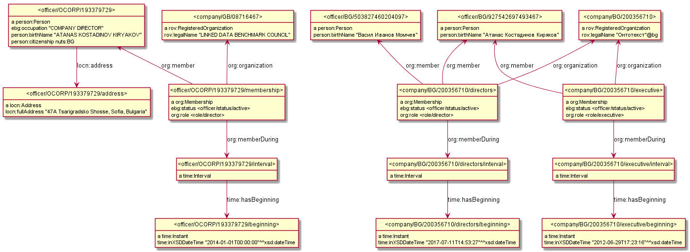

# Data Exploration

## OCORP

[Search Atanas Kiryakov](https://opencorporates.com/officers?utf8=%E2%9C%93&q=atanas+kiryakov&commit=Go&utf8=%E2%9C%93&commit=Go&action=search_officers&controller=searches),
eg https://opencorporates.com/officers/193379729

```
Company: LINKED DATA BENCHMARK COUNCIL
Name: ATANAS KOSTADINOV KIRYAKOV
Address:                     (Sorry, you need to be logged in to see this address)
Position: director           (of the related company)
Occupation: COMPANY DIRECTOR (of the person himself)
Nationality: BULGARIAN
Start Date: 2014-01-01
Status: active               (because there's no End Date)
```
- Does not have person deduplication: an officer ID may carry the same person names & nationality as another officer (with no link between them), even within the same company.
  Eg https://opencorporates.com/companies/gb/08716467 lists
  https://opencorporates.com/officers/261515300 YINGLONG XIA, director, 22 Jun 2016- (ACTIVE)
  https://opencorporates.com/officers/261468785 YINGLONG XIA, director, 22 Mar 2015-21 Jun 2016 (INACTIVE)
  but it's obviously the same person

## BG TR
https://public.brra.bg/CheckUps/Verifications/ActiveCondition.ra?guid=617f4edf8c154f4296efdf146513de21 and enter the captcha (or may need to paste EIK=200356710)
```
10. Представители        20120629172316 (Company Representative, i.e. CEO; date) 
Атанас Костадинов Киряков 
12. Съвет на директорите 20170711145327 (Board of Directors; date)
Васил Иванов Момчев
Цветан Борисов Алексиев
КОНСТАНТИН ГЕОРГИЕВ ПЕТРОВ
Атанас Костадинов Киряков
Златолина Иванова Мукова
```
- both items 10 and 12 include links История (history) that gives dated changes to officers.
- The main page lists the latest record, and I think this is what ONTO's BG TR includes (not the history). So we'd have only Active officers, and no End Date
- The Start Date is shown at the main record (eg 20120629 for item 10, and 20170711 for item 12)
- includes "Начинът, по който се определя мандатът: Продължаване на мандата с 2(две) години" (mandate extended by 2 years)
- includes "Дата на изтичане на мандата: 20.06.2014" (mandate expired), but that's probably copied from 29.6.2012 (the current
- Person identities are kept: BG TR includes a hashed version of the official person ID, so you can tell which companies a certain person is related to
- all Directors (item 12) are listed as a group, so we could use one Membership record for all (as a shortcut)

# Mapping notes/questions
- https://www.w3.org/ns/person is very basic, doesn't even include birth/death dates. So we may use schema:Person
- Standard data requirements:
  - Id (also used in URL)
  - Names (one field)
  - Status: active/passive (if available). Confirm we can use a standard lookup
  - Role (position): Can we make a standard lookup list for Role: CEO/Manager/Representative (typically one), Director (many).
    In OCORP this looks like free text.
    if not, we can use a free text but...
- Extra data requirements:
  - Occupation (in addition to role)?
  - Address?
  - Nationality?
  - Person Id?

# Example

The example below shows the following Officer records:
- one director from OCORP UK (Kiryakov at LDBC)
- one executive from BG (Kiryakov at ONTO)
- two directors from BG (Kiryakov and Momtchev at ONTO).
  - The shared `org:Membership` will work only if the whole board of directors
  - The chosen `org:Membership` URLs (1:1 with company) will work only if only the most recent officer records are RDFized. Otherwise a GUID should be used.


